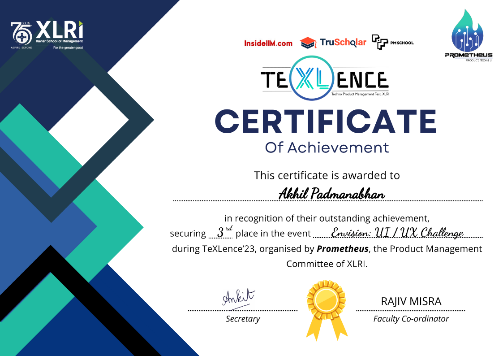
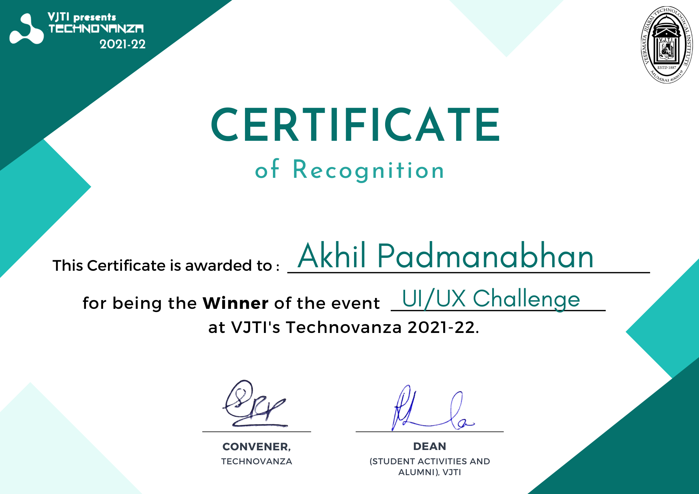
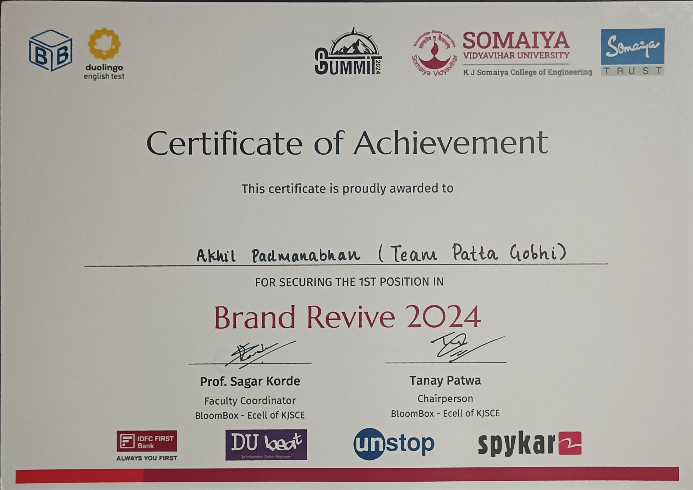
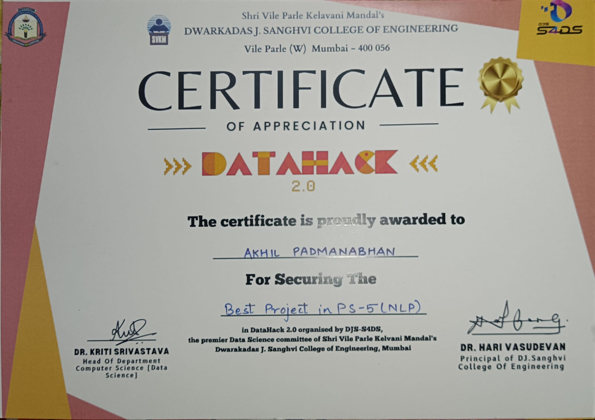
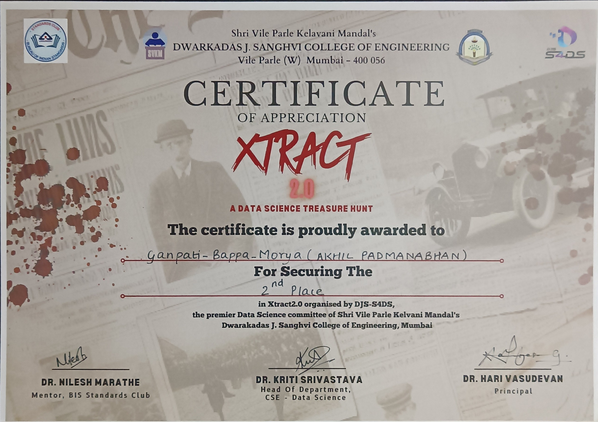
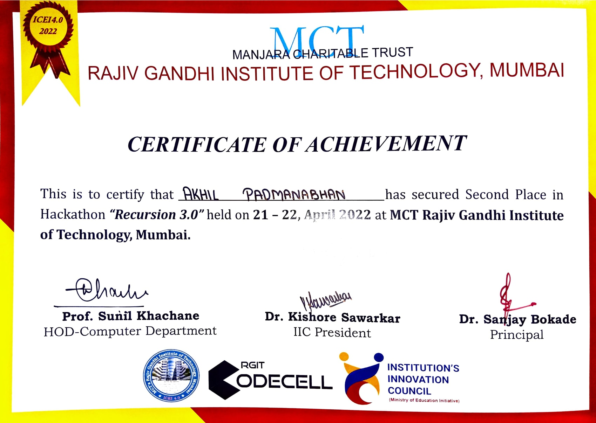
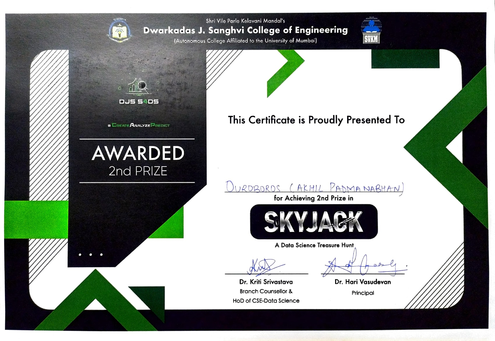

# 🏆 Achievements

Welcome to my Achievements repository! Here, I've compiled a collection of my certificates and accolades from various competitions and events. Each certificate is a testament to the hard work and dedication I've invested in my endeavors.

## Achievements

### Envision UI/UX Challenge - 2nd Place

Secured the 2nd position in the Envision UI/UX Challenge organized by XLRI Jamshedpur.

### UI/UX Challenge at VJTI Technovanza - 1st Place

Achieved 1st place in the UI/UX Challenge held during VJTI's Technovanza event.

### Brand Revive Competition - 1st Place

Won 1st place in the Brand Revive competition organized by E-Cell KJSCE.

### DataHack S4DS Track at DJSCE - 1st Place

Secured the top position in the DataHack S4DS Track at DJSCE.

### Extract Competition by S4DS at DJSCE - 2nd Place

Awarded 2nd place in the Extract competition organized by S4DS at DJSCE.

### Recursion3 at RGIT - 2nd Place

Achieved 2nd place in the Recursion3 event at RGIT.

### SkyJack by S4DS at DJSCE - 2nd Place

Secured 2nd place in the SkyJack competition organized by S4DS at DJSCE.

---

Feel free to explore each certificate to learn more about the events and the accomplishments. Thank you for visiting my Achievements repository!
